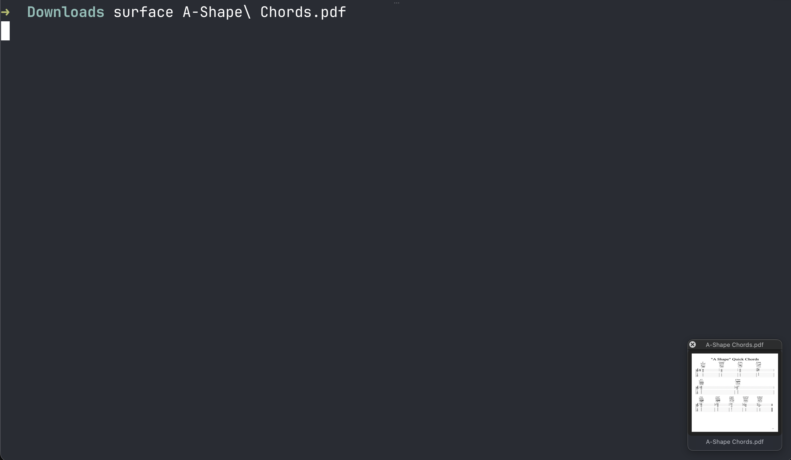

# surface

A bridge between your terminal and your desktop. When you're working in the terminal and need to quickly get a file into a GUI app — drag it into a browser upload, drop it in Slack, attach it to an email — `surface` floats a small draggable thumbnail on your screen so you don't have to go hunting through Finder.

```
surface report.pdf
```

A thumbnail appears in the corner of your screen. Drag it wherever you need it. The window closes automatically after a successful drag. You can also double-click to open the file directly.



## Install

```
brew install AndrewHannigan/tap/surface
```

## Usage

```
surface <file>
```

## Building

Requires macOS and Xcode (or Xcode Command Line Tools).

Build a universal binary (arm64 + x86_64):

```bash
swiftc -O -o surface_arm64 -target arm64-apple-macosx11.0 -framework Cocoa -framework QuickLookThumbnailing surface.swift
swiftc -O -o surface_x86 -target x86_64-apple-macosx11.0 -framework Cocoa -framework QuickLookThumbnailing surface.swift
lipo -create surface_arm64 surface_x86 -output surface
rm surface_arm64 surface_x86
```

Or build for the current architecture only:

```bash
swiftc -O -o surface -framework Cocoa -framework QuickLookThumbnailing surface.swift
```

## Deploying

1. Commit and tag a new version:

   ```bash
   git add surface.swift
   git commit -m "Description of changes"
   git tag vX.Y.Z
   git push origin main vX.Y.Z
   ```

2. Build the universal binary (see above) and create a GitHub release:

   ```bash
   gh release create vX.Y.Z --title "vX.Y.Z" --notes "Release notes"
   gh release upload vX.Y.Z surface
   ```

3. Get the SHA256 of the uploaded binary:

   ```bash
   curl -sL https://github.com/AndrewHannigan/surface/releases/download/vX.Y.Z/surface | shasum -a 256
   ```

4. Update the formula in [homebrew-tap](https://github.com/AndrewHannigan/homebrew-tap) — set the new version, URL tag, and SHA256 in `Formula/surface.rb`, then commit and push.
